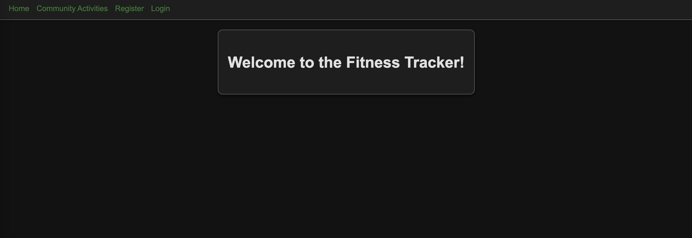

# Fitness Tracker

A web application designed to help users track their fitness activities. The app allows users to log in, create, view, update, and delete fitness activities.

---

### Deployed App
[Click here to view the deployed app](<https://pers-fitness-tracker-app-51ed0c8a2e7a.herokuapp.com/>)

## Screenshot

---

## Description

### About the App
The **Fitness Tracker App** is focus aroud full CRUD
- **Create** new fitness activities.
- **View** their created activities.
- **Update** activities as needed.
- **Delete** activities that are no longer relevant.

The app includes session-based authentication to ensure data privacy. Guest users can browse public activities but cannot create or modify any data.

### Why I Built It
I built this application for users who want to track their physical activities.

---

### Planning Materials
- **Wireframes**
- **User Stories**
- **ERDS**

---

## Attributions

This app was built using the following tools and resources:
- **EJS Templates**
- **Node.js**
- **Express.js**
- **MongoDB**
- **Mongoose**
- **CSS**
- **WCAG Color Contrast Checker**

---

## Technologies Used

- **Frontend**: HTML, CSS, EJS Templates
- **Backend**: Node.js, Express.js
- **Database**: MongoDB, Mongoose
- **Authentication**: Session-based with Express-Session
- **Version Control**: Git and GitHub

---

## Next Steps

Here are some planned future enhancements for the Fitness Tracker:
1. **User Profiles**: Expand functionality to include a customizable user profile with stats.
2. **Activity Sharing**: Enable users to share their activities with friends or on social media.
3. **Analytics Dashboard**: Add graphs and charts to provide insights into fitness progress.
